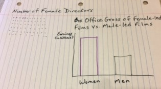

# Outline
Women have been underrepresented in the movie industry in front of, and behind the camera, but films that feature women in those roles have grossed high returns, earned major awards, and told unique stories, so we all benefit from supporting their efforts. 
As a reader, I want to help equalize the number of women to men in the movie industry as soon as possible, so I can ensure that women are valued equally in American society through the stories, images, and impact of these films on children and adults. 

# Project Structure
My audience is move-going adults.  

My story arc is to use data visualizations to show:

Setup: Women are vastly underrepresented in film, both in front of, and behind the camera. This includes the number of female leading roles and female directors vs. the number of men in those positions. The project will focus on data from 2000-2020.  

Conflict: The lack of female representation in the film industry is bad economically and culturally. I will introduce the Bechdel scale which is a simple three-point test to determine minimum participation of women in a film. First, are there two or more women in the film? Second, do they speak to each other? Third, do they talk about anything other than men? It's a low bar, but I will show that no film since 2012 has grossed over a billion dollars without passing that test. Also, I will demonstrate that the highest grossing films from 2014-2017 had female leads. Next, I will show how films directed by women performed financially. 

Next, I will show the cultural impact of women's underrepresentation in film. Not only is equality in this case a matter of justice and good business, but the images of women in film influence perceptions about what women and girls can be and do. These messages affect men, women, girls, and boys. I will include data on parents' concerns about the impact of these depictions on children. 

Resolution: I will conclude with calls to action on what we can do now and for the future to combat this problem. We can see films made by women and starring women. Parents and adults can help children understand the importance of women and girls being equally represented as active, strong characters in film. This includes watching and discussing stories that feature girls and women as equal partners with men in action-oriented, decision-making roles. I will show data on where we are now and how these actions will change those outcomes. 

# Initial Sketches

# Data 
I will use data from this study by the [Annenberg Inclusion Initiative](http://assets.uscannenberg.org/docs/aii-inequality-report-2019-09-03.pdf) to do most of the visualizations described in the project structure above. This study by the [Creative Arts Agency](http://shift7.com/media-research) provides data showing that the 2014-17 top grossing films had female leads. The infographic in this report by [Common Sense Media](http://www.commonsensemedia.org/watching-gender-infographic) features data on parents' concerns about the impact of media on children's perception of gender. I will be recreating the data from all of the sources, because they are not available publicly. It will be easy to do, however, because they are small data sets and tables. 

# Method and Medium
I will use shorthand to complete my project and Tableau to create the data visualizations. I also will search for captivating images of female-led films that were among the top grossing films, as well as images that show adults and children viewing films or any media on screen together as part of the calls to action. 

My timeline is to follow the class assignment schedule. More specifically, in Week 2, I'll create and test wireframes and search for images. In Week 3, I'll revise my wireframes per the feedback, search for additional images as needed, and create the 60-second presentation for class. I will then practice that presentation before a representative audience, get feedback, and revise accordingly before Feb. 23. I will do the same for the final project. 

# Link to Main Page
[Link to Other Page](https://lortenzo.github.io/Ortenzo-portfolio/)

# Link to Final Project Part 2
[Link to Other Page](/FinalProjectPart2.md)

# Link to Final Project Part 3
[Link to Other Page](/FinalProjectPart3)
