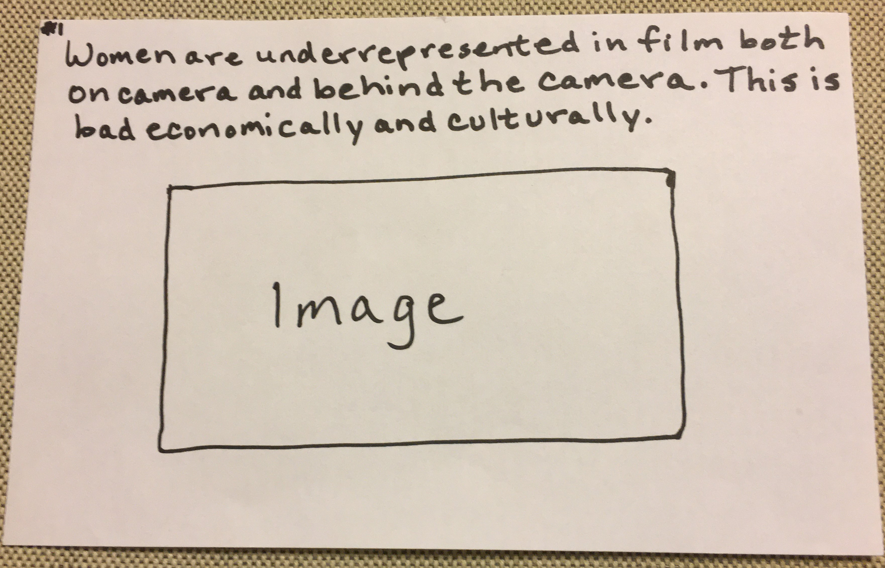
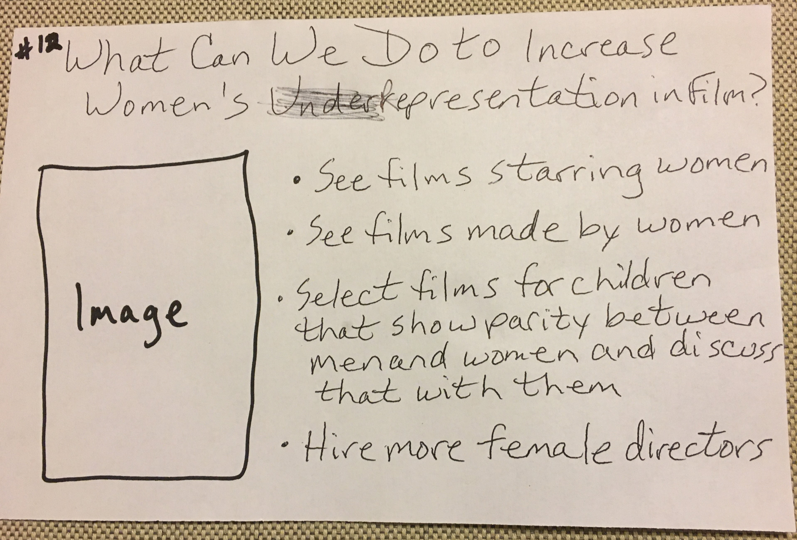

# Original Wireframes

Below are the original wireframes, the research plan to test them, and the results of that testing. 

# Interview Feedback 
Women in Film Final Project Research Plan 

Target Audience:
Movie-going adults, Parents, Older Teens

Secondary Audience:
Industry executives

Goals:
1) Evaluate understanding of the story
2) Assess the effectiveness of the storyboard
3) Evaluate interest in the story
4) Assess the effectiveness of the visualizations in communicating the data
5) Determine what is confusing, if anything
6) Determine ways to improve the storyboard and visualizations 

Questions: 
1) Describe what this is telling you
2) How interested are you in the story on a scale of 1 - 5 (1 is the lowest and five is the highest)? 
3) Describe any feelings you have about this information, if at all
4) Describe how effective the storyboard is in telling this story 
5) Does anything here prompt you to do something?				
6) What would you change? Why?

Method:
20 minute in-person interviews

Interviewees:
I focused on recruiting people within my target audiences. I had hoped to interview one more male, but could find only one available in the time frame for testing. I interviewed five people with the following demographics.

1) Female Age 17 
2) Female Age 56 Parent
3) Male   Age 65 Parent
4) Female Age 34 Movie-goer, married, not a parent
5) Female Age 38 Movie-goer, married, not a parent

Script: 
"Thank you for agreeing to do this interview. This is a storyboard of my final project for a class called 'Telling Stories with Data'. These are very rough hand drawings set in order to tell a story - kind of like a comic strip. After you read these panels, I'll ask you some questions, and type your answers. You will remain anonymous. I will use your feedback to revise these panels, and then do them on the computer. Your honest feedback is most helpful. Feel free to ask me questions about anything you see. Go ahead." 

Key Findings: 
When asked to describe the story, all interviewees stated the central message of the underrepresentation of women on-camera and behind the camera, and noted that the disparity was a problem both economically and culturally. They all recognized that films starring women made more money than those starring men. They each said they had heard of the disparity in the number of female directors to male directors, citing the recent Oscars as an example, but they didn't know the extent of the issue and found the actual numbers startling. All expressed concern about the effects on children of the disproportionately few women in leading movie roles playing strong characters equal to men, as presented in the storyboard. 

Interest in this story was a "5" for the two 30-something women and the 17-year old female, who felt it was important from their perspectives as females. The interest level was a "4" for the 56-year old women with two sons and two daughters who saw it as important information for all of them to know. The male parent rated his interest as a "3", saying he got that it was important, but saw movies to be entertained no matter who stars in them. Their responses to the calls to action included seeing films that star women, although the females said they do that anyway. This just made them think more about why it's important to do it as much as possible.

When asked to describe the effectiveness of the storyboard in telling the story, the females age 17 and 56 said it was good, had all the necessary information, and was in a logical order. The 17-year-old said, "That's how I would've done it." The other three interviewees had these comments about the sketches and the order: 

Male (age 65) - "Do you need 4 AND 5? I get that an image is good, but #5 tells the story." "Do you add the numbers in #5? Oh, now I see what that's trying to say." 

The two 30-something females also said #5 was confusing and it took them a minute to get the meaning. They wondered if the visual could be made clearer that films starring women earned more than men. 

Those same three people made other similar suggestions:
1) Moving or eliminating #3, because it just covered three years
2) Making #6 more clear, suggesting I re-order and re-size the circles for a greater impact

All interviewees suggested clarifying #7 to better explain the Bechdel Test. They liked the female symbols and speech bubbles, but they had trouble understanding "other than men", and thought making that clearer would help. 

The 34-year old females said, "I feel like adding the concern about children earlier will have more impact, but I like the story regardless." She was the only one to raise this point. 

The male suggested putting #6 and #5 after #1, because they had the most impactful data visualizations of women's disproportionately less dialogue and directing opportunities respectively, and the rest of the sketches would provide the detail. He's the only one who suggested that. 

The 38-year old female said, "I think you need something to tie the impact on children with the economic information before it." She was the only one to make that comment. 

Revisions based on feedback: 
I revised #5, #6, and #7 since most or all interviewees said they needed to be clearer. I eliminated #3, since several people said that wasn't helpful. I also decided to retain the same order after a lot of thought, because it made sense to me, and because the feedback otherwise was contradictory. 

Below are revised wireframes in a storyboard format. 

# Revised Wireframes

One way we see this is in the low level of speaking parts women have compared with men.

Yet, female-led films are more successful.

Of the 350 films analyzed from 2014-2017, 105 are cited as female-led and 245 are listed as male-led in Studio System. The difference in their earnings is telling.

Another indicator of disparity is how much women speak in films. 

There's even a test to assess women's on-screen participation.

It's an incredibly low bar, but a key indicator of a film's success. 

Women's representation behind the camera is just as dismal.

What effect is this having culturally? It starts very young.

We have the power to change this.

[Link to other page](/FinalProjectPart1.md)
