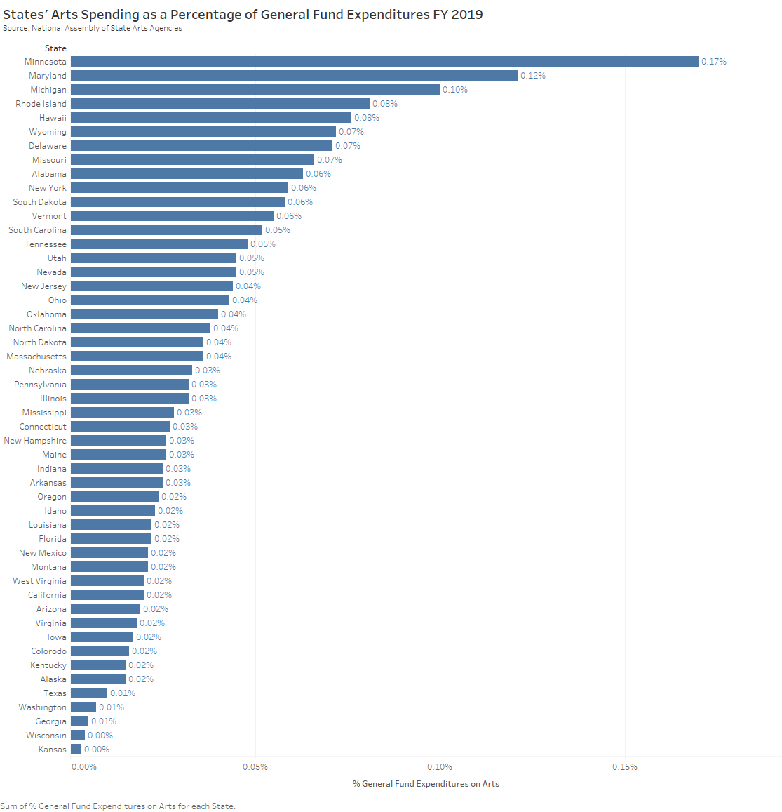

# Ortenzo-portfolio
Visual story-telling with a kick

# About Me
I have a passion for helping people to understand complex, challenging ideas through engaging and accessible experiences. That led me to a 23-year career at Carnegie Science Center, one of the four Carnegie Museums of Pittsburgh. I was Director of STEM Programs for the last 15 years. In that role, I led a team who developed and implemented programs and competitions that served 10,000+ middle and high school students each year. They continue today. The experiences are designed to inspire students to explore STEM (science, technology, engineering, and math) topics and careers. Students do hands-on activities or major projects and interact with leading professionals in these fields. Throughout my career, I loved the mix of creative and strategic work and the opportunity to have a real impact on students' lives. I also enjoyed serving in senior leadership of the Science Center. 

For several years, and especially after the 2016 election, I felt a growing need to use my skills in informal education to help bridge our politically polarized nation through informed, civic engagement and media literacy. That led me to the Master of Public Management Program at the Heinz College at Carnegie Mellon University. I wanted to expand my skills in public policy and quantitative analysis, then create exciting, effective experiences to help voters to do the same. Ultimately, my goal is to help us to become a more skilled and savvy electorate and a more civil society. 

(She/Her/Hers)

# What I Hope To Learn 
Honing my data visualization skills is part of the effort I described above. That's why I'm taking this "Telling Stories with Data" class. In my experience, and in research by the National Science Foundation and other organizations, Americans don't understand statistics. Data can be easily manipulated to mislead those who aren't equipped to challenge them. Creating clear, compelling data visualizations can communicate and educate in ways that will make us smarter collectively. That is my mission.    

# Portfolio
Check here for my visualizations! 

Assignment 3 & 4

Original Data Visualization 
Table 8: https://nasaa-arts.org/wp-content/uploads/2019/02/NASAA-FY2019-SAA-Revenues-Report.pdf

I chose this visualization, because I have a lifelong involvement in the performing arts and sing professionally, and am interested in arts funding nationwide. I also think that it has a compelling story to tell about which states are supporting the arts at the highest levels which may surprise readers, but is getting lost in this table. I felt I could make it more compelling. 

My Process
When I did the first critique, I found that the story of how the percentages of arts funding by state compared was lost in two ways. First, the table provided the data alphabetically, which didn't show a ranking of state funding from largest to smallest. Secondly, it had random blue highlighted sections that were confusing, because they didn't indicate anything in particular. It was just a design. I used bar charts in my wireframes to show this ranking. In both wireframes, I had the range of percentages on the y-axis and the state abbreviations on the x-axis with vertical bars showing the values for each. In one wireframe the state abbreviations were above each bar, and in the other they were below each bar. 

The feedback I got was that it was hard to read these abbreviations (it was a hand drawing, so I expected that). Viewers also said that they wanted to know the source of the information and to see the percentages clearly for each state. The bars alone weren't precise enough to show the specific values. It took time and thought to figure out what each percentage was. For these reasons, I decided to create a chart with horizontal bars, the percentages at the ends of each bar, and the state names spelled out on the y-axis. I think it's cleaner and clearer to read and understand the ranking of arts funding by state. I used the same color scheme as the report from which the original visualization came to indicate how the redesigned version could replace the original.  

# Redesigned Data Visualization 

